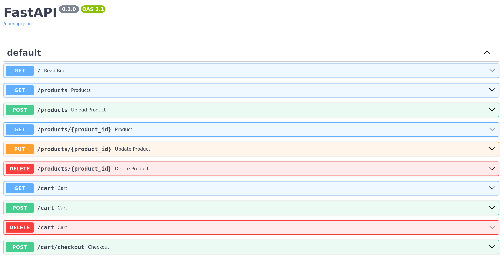

# Ecommerce API - ScyllaDB & FastAPI sample application
This is a sample ecommerce application built with [ScyllaDB](https://www.scylladb.com/) and [FastAPI](https://fastapi.tiangolo.com/).


## Prerequisites
* [CQLSH](https://cassandra.apache.org/doc/stable/cassandra/tools/cqlsh.html)
* Python 3
* [ScyllaDB Cloud account](https://cloud.scylladb.com)

## Get started

Clone the repository:

```
git clone https://github.com/zseta/shopping-cart
cd shopping-cart
```

## Create database schema

Connect to your ScyllaDB Cloud cluster using CQLSH and create the schema:

```
cqlsh -u scylla -p <YOUR_PASSWORD> -f schema.cql xxxx.xxxx.xxxx.clusters.scylla.cloud
```

## Set up API server

Create a new virtual environment:
```
virtualenv env
source env/bin/activate
```

Install Python requirements (FastAPI with Uvicorn server and ScyllaDB driver):
```
pip install fastapi "uvicorn[standard]" scylla-driver requests
```

Modify `config.py` to match your database credentials:

```python
HOST="node-0.aws-us-east-1.xxxx.clusters.scylla.cloud"
USER="scylla"
PASSWORD="xxxxxx"
DATACENTER="AWS_US_EAST_1"
KEYSPACE="ecommerce"
```

Run the server:
```
uvicorn main:app --reload
```

Visit API docs: http://127.0.0.1:8000/docs



## Generate sample data

Insert products to the database:
```bash
cqlsh <ip_address>
COPY ecommerce.product (id, img, name, price) FROM 'product.csv' with HEADER = TRUE;
```

Generate user interactions (adding products to cart, checkout):
1. Run the API server:
    ```
    uvicorn main:app
    ```
1. Run the python script:
    ```bash
    python generate_requests.py
    ```
    ```
    Shopping started - User(6773b120-8499-4196-9df8-2c4a60b6f1ac) 
    (1) Added to cart: abe0e6dc-6ad1-4c3e-8127-80c6176ce99a 
    (2) Added to cart: ee9b125d-c92f-4555-bdb3-35aa260b6f91 
    (3) Added to cart: 2bf36d87-9b36-4bd3-a44a-8d167e189ce6 
    (4) Added to cart: 0c38b0c8-a792-4128-bff9-64c527366202 
    (5) Added to cart: 609ed832-e565-4f46-830b-5fabc120e1d4 
    Checkout completed (5 items)! 
    -----
    (1) Added to cart: e8ce5e13-0a7e-4e6e-8858-252f5b1cb1db 
    (2) Added to cart: 3a33f31b-b37c-413e-81a5-1f4b42cedcf6 
    (3) Added to cart: ffa5f74c-26f2-4342-a6f4-ee2338dd205f 
    (4) Added to cart: ef281712-2169-49e4-880a-8da503b0b6de 
    (5) Added to cart: 1e8abb0c-f558-433c-a8c8-e029f12c0d7d 
    (6) Added to cart: 609ed832-e565-4f46-830b-5fabc120e1d4 
    Checkout completed (6 items)! 
    -----
    (1) Added to cart: 0015b10c-0842-4796-840a-2e43a6a719d3 
    (2) Added to cart: abe0e6dc-6ad1-4c3e-8127-80c6176ce99a 
    (3) Added to cart: 0c38b0c8-a792-4128-bff9-64c527366202 
    Checkout completed (3 items)! 
    -----
    ```
    You can run this script from multiple terminals to generate more data.

## Change Data Capture (CDC)
Change Data Capture (CDC) is a ScyllaDB feature that records every change (insert, update, delete) that happens in your table. CDC provides real-time and historical insights into user behavior, product performance, and activity. 


Here are some example CDC queries that can be useful for an ecommerce application:

**How many times do users add more than 2 of the same product to the cart?**
```sql
SELECT count(*) 
FROM ecommerce.cart_items_scylla_cdc_log 
WHERE "cdc$operation"= 2 AND product_quantity > 2
ALLOW FILTERING;
```

**How many carts contain a particular product?**
```sql
FROM ecommerce.cart_items_scylla_cdc_log
WHERE "cdc$operation"= 2 AND product_id = dc87a43f-53b2-48a2-9003-2654345b6647
ALLOW FILTERING;
```

Notice how in both cases we put `"cdc$operation"= 2` in the where clause. This is because if the operation is `2` that means it was an `INSERT` operation. Learn more about [ScyllaDB CDC](https://opensource.docs.scylladb.com/stable/features/cdc/cdc-intro.html).
